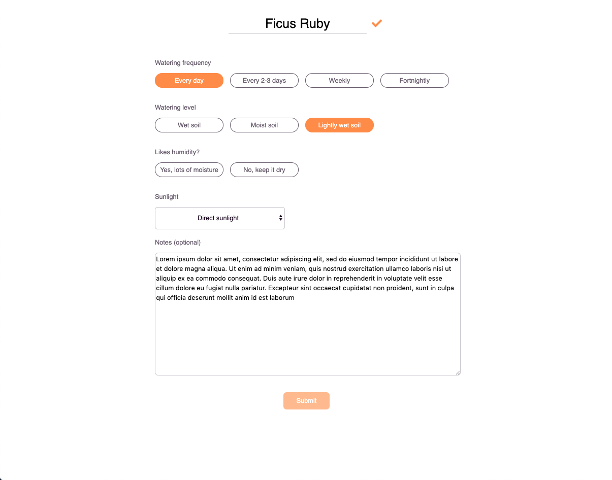

# blooms-2.0

Following [Creating a react app from scratch tutorial](https://blog.usejournal.com/creating-a-react-app-from-scratch-f3c693b84658) to build React app

Adding on a database and API using NodeJS and MySQL

